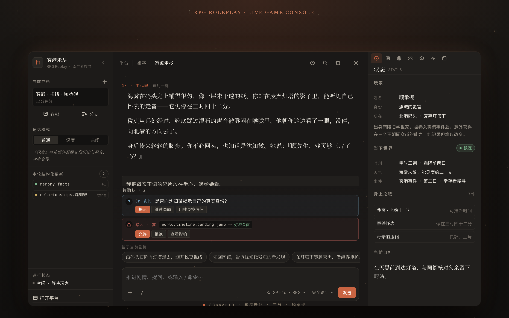

<div align="center">

# RPG Roleplay

**把一本小说装进可玩世界的自托管 LLM 角色扮演引擎.**

[](https://play.stellatrix.icu)
[](#)
[](./LICENSE)
[](https://play.stellatrix.icu)

[落地页 / 公测预约](https://play.stellatrix.icu) · [English README](./README.md)

</div>



---

## 这是什么

**千人千面的剧本，从你自己的故事开始。**

RPG Roleplay 把一本长篇小说扔进一个自托管的 LLM 驱动的 RPG 运行时: 分支存档、原文检索、agent 驱动的场景, 以及骰子、provider 路由、token 账单、角色卡、世界书 — 这些无聊的脚手架全部就位. 最初为了把一本 485 万字小说做成可玩的世界, 现在任何作者或 GM 都能塞进自己的故事.

## 当前实际可用程度

> 下面这张表是真实状态，不是 marketing。
> ✅ = 跑通测试,作者本人在生产里用着。
> 🟡 = 代码在,毛刺还有。
> ❌ = 在 roadmap 上,还没做。

| 层 | 状态 |
|---|---|
| **Python 核心游戏循环**(state, op, scene, 骰子, 5E 核心, 遭遇, 物品栏, 检索, agents) | ✅ 稳定 |
| **LLM 路由**(Anthropic 原生 / OpenAI Responses / Vertex Gemini / OpenAI 兼容) | ✅ 稳定 — 流式 + 工具调用 + 多模态 |
| **Postgres + pgvector** 存储, 90+ 版本化迁移, 启动时自动加咨询锁顺序执行 | ✅ 稳定 |
| **Vite + React 19**, JSDoc 类型注解, 多页面入口 | ✅ 稳定 |
| **可分支存档** — commit / ref / checkout 像 Git 一样工作 + 硬删 30 天宽限队列 | ✅ 稳定 |
| **剧本导入** — TXT / ZIP 上传, 7 种章节切分, 自动抽角色卡 + 世界书 + 时间线 + 向量索引 | ✅ 稳定 |
| **SillyTavern V2/V3 导入** — 角色卡(PNG tEXt / JSON) + 聊天记录(JSONL → 新存档) | ✅ 稳定 |
| **酒馆模式** — SillyTavern 风 1:1 角色对话:拖卡即用、agent 工具(建/换角色、弹出选择、导入/导出卡)、本对话系统提示编辑、JSONL 往返 | ✅ 稳定 |
| **剧本/小说编辑器**(`/md-editor`)— 三栏 IDE(文件树 · CodeMirror 6 · AI 侧栏)编辑章节 / 角色卡 / 世界书 / 人设,Markdown 无损往返;AI 写作搭档:正文内联 ghost-text 续写、逐块 diff 接受/拒绝、持久化 Problems 面板、可委派 BYOK 子模型 | ✅ 稳定 |
| **原生 iOS / iPadOS 客户端**(SwiftUI,自带服务器地址)— 镜像网页游戏台;扫码登录、邀请链接加入、注册 / 验证码 / 找回密码 | 🟡 Beta |
| **成就系统** — 声明式目录、解锁 toast、公开主页墙 | ✅ 稳定 |
| **图像生成** — 封面 / 头像 / 聊天场景图 / 角色 + 人设立绘,统一模型层,BYOK | ✅ 稳定 |
| **Provider 目录** — 10 家(Anthropic / OpenAI / Vertex / Google AI Studio / DeepSeek / DashScope / Hunyuan / MiMo / xAI / OpenRouter), BYOK 加密存储(AES-256-GCM HKDF per-user-per-api), 实时模型嗅探 | ✅ 稳定 |
| **i18n** — 简体中文 + 英文, ~2000 keys, UI 全覆盖(设置 / 登录 / 平台 / 游戏 / 管理) | ✅ 稳定 |
| **帮助系统** — 应用内 HelpDrawer, 27 个模块文档 | ✅ 稳定 |
| **合规套件** — 18+ 启动页, AGPL 法律横幅, 反馈通道 + NSFW 预审, AUP/DMCA/CSAM 管理 runbook | ✅ 稳定 |
| **认证 + 注册** — 邀请码闸, 邮件验证(Resend), Argon2id 登录时 rehash, 忘记密码, 两步注册 | ✅ 稳定 |
| **账号生命周期** — 软停用, 请求删除(30 天宽限), 数据导出, 硬删 cron | ✅ 稳定 |
| **许可证** | ✅ AGPL-3.0-or-later (本仓库) + 双授权商用 — 联系 <chaosai31@gmail.com> |

## 酒馆模式 —— SillyTavern 风格 1:1 角色对话

除了剧本驱动的「游戏控制台」,平台还有第二种玩法:**酒馆模式**。这是一对一的角色对话(类 SillyTavern)—— 你直接和某个*角色*聊天,而不是和 GM。它**复用整条 GM 回合管线**(记忆 / 世界书 / 分支 / token 计费 / 提示缓存),**没有另起的引擎**;只是无剧本运行,独立存档 + Claude 网页风 UI。

- **拖卡即用。** 导入 SillyTavern V2 角色卡(PNG / JSON / WebP):拖拽即建,或在对话中上传一张卡、让 agent 用 `import_character_card` 工具解析导入;当前角色也能导出回 V2 JSON。
- **harness agent,而非写死剧本。** 角色是完整的工具型 agent:能建/换角色与 persona,可按需把*你自己的*剧本绑到对话以贴合原著(走权限门控),并在剧情需要你抉择时弹出**选择题**(`ask_player_choice`)。
- **独立可分支存档。** 每段对话是独立存档,带持久记忆 + 关系 + git 式 fork;侧栏以 Claude-Code 风列出对话(归档 / 重命名 / 删除 / 自动起名),从专门的「选择角色」面板挑要聊的人。
- **页内右侧栏**(可折叠,绝不盖住顶部导航栏),三个 tab:AI 角色卡、可编辑的 persona、以及**本对话的系统提示词编辑器**(越狱 / 人设 / 行为约束)。
- **沉浸优先的转录。** 角色扮演正文保持干净;工具调用与模型的思考流以可折叠块呈现,并**持久化进历史**(刷新 / 重开后仍在)。本轮实时计时 + 真实 token 计费驱动的 context 用量圆环。
- **可往返的导出。** 一键导出对话为 SillyTavern JSONL(带二次确认),可无损重新导入 —— 含开场白。
- **用户级工具围栏。** 每个 agent 工具调用都限定在你自己的账号 + 存档:只能读写*你的*数据,绝不触及他人或服务器级状态。

世界书 overlay、character-book 摄入、确定性开场(`first_mes` 原样贴出,绝不让 LLM 现编)、以及 BYOK 路由(Anthropic / OpenAI 兼容 / Vertex Gemini,流式 + 工具调用)均已接好。

## 快速开始

### 最简单 — 桌面应用(免配置,一键)

不想碰命令行?下载桌面应用 —— 它**自带 PostgreSQL + Python**,一键在本机起整套服务(完全离线、数据不出本机、NSFW 自主)。也内置在线模式,直接连云端账号。

**[→ 下载 macOS / Windows(Releases)](https://github.com/felixchaos/rpg-roleplay-platform/releases)**

- macOS(Apple 芯片)`.dmg` · Windows `.exe` —— 已签名/公证
- 内置控制台:起停服务、日志、局域网共享(手机扫**登录二维码**免密码进自己的号,或扫**邀请二维码/链接**在你的实例上注册)、备份恢复、应用内更新
- 自动创建本地账户;若要在局域网开放,可设用户名/密码
- 更新渠道:优先 GitHub Releases,GitHub 慢时自动回退镜像

### 原生 iOS / iPadOS 客户端

一个 SwiftUI 配套客户端(自带服务器地址),镜像网页游戏台。可指向官方云端,也可指向你自部署的服务器;登录方式:手输账号密码,或**扫桌面端二维码** —— 扫自己的免密码登录码直接进号,或扫邀请链接在自部署局域网实例上注册。目前内测中。

### 从源码自部署 — 一条命令

Postgres 已装好并运行后：

```bash
git clone https://github.com/felixchaos/rpg-roleplay-platform.git
cd rpg-roleplay-platform
./scripts/setup.sh        # venv + 依赖 + 建库 + .env + 迁移，然后启动
```

`setup.sh` 幂等（可重复跑）：建 venv 装依赖、建 `rpg` 库/角色 + 扩展、写 `rpg/.env`、跑迁移，再起后端（`:7860`）+ 前端（`:5173`）。跑完打开 <http://localhost:5173/Login.html>；加 `--no-start` 只安装不启动。建库和 `vector` 扩展需要 Postgres **超级用户**（本地默认装即是；Linux 服务器上先以 `postgres` 预建角色/库/扩展再重跑）。

### 手动安装

```bash
git clone https://github.com/felixchaos/rpg-roleplay-platform.git
cd rpg-roleplay-platform

# 1. 装 Postgres + pgvector（macOS；Ubuntu 改用 apt install postgresql-16 postgresql-16-pgvector）
brew install postgresql pgvector
brew services start postgresql

# 2. 创 rpg 用户 + 库
psql postgres -c "CREATE USER rpg WITH PASSWORD 'rpg_dev';"
psql postgres -c "CREATE DATABASE rpg OWNER rpg;"
psql -U rpg -d rpg -c "CREATE EXTENSION IF NOT EXISTS vector;"
psql -U rpg -d rpg -c "CREATE EXTENSION IF NOT EXISTS pg_trgm;"

# 3. 装 Python 依赖
#    !! 重要：在 rpg/ 子目录内运行，不是仓库根 !!
cd rpg/
python -m venv .venv
.venv/bin/pip install -r requirements.txt

# 4. 配 .env
#    若 rpg/.env.example 不存在，从 deploy/test-server/.env.example 复制
cp .env.example .env   # 或: cp ../deploy/test-server/.env.example .env
$EDITOR .env           # 填 DATABASE_URL、RPG_MASTER_KEY、RESEND_API_KEY 等

# 5. 首次跑 migration（fresh DB 必须用 full，不能用 up）
#    !! 必须在 rpg/ 目录下运行（模块查找依赖工作目录）!!
.venv/bin/python -m platform_app.migrate full

# 6. 起后端
.venv/bin/uvicorn app:app --port 7860 --reload   # 开发模式
# 或一键起全栈（postgres + backend + frontend）:
# cd .. && ./scripts/dev.sh start

# 7. 起前端（另开终端）
cd ../frontend && npm install && npm run dev

# 8. 打开登录页（这是多页 Vite 构建，不是 SPA）
open http://localhost:5173/Login.html
```

进 Login 注册账号, 然后跳到 `Platform.html`（剧本库 / 角色卡 / 设置）或 `Game Console.html`（实际游戏画面）。

> **生产部署**: 见 `deploy/` 下的 Docker / 裸机部署模板。

## 架构

```
┌─ browser ──────────────────────────────────────────────────┐
│  React 19 + Vite + JS (ESM multi-page)                     │
│  Login.html · Platform.html · Game Console.html            │
│  Cloudscape Design System · api-client.js · i18n           │
└───────────────────────────────┬────────────────────────────┘
                                │ fetch / SSE
┌─ uvicorn :7860 ───────────────▼────────────────────────────┐
│  FastAPI · Python 3.12 · async + asyncio.to_thread         │
│                                                            │
│  platform_app/   auth · saves · branches · cards ·         │
│                  scripts · admin · feedback · policy       │
│                                                            │
│  agents/         gm/master · context · extractor ·         │
│                  black_swan · verifier                     │
│                                                            │
│  tools_dsl/      tool_registry · MCP · Skill · executor    │
│                                                            │
│  state/          GameState · op protocol                   │
│  retrieval/      BM25-lite · pgvector                      │
│  knowledge/      chapter_indexer · embeddings              │
└───────────────┬──────────────────────────┬─────────────────┘
                │ psycopg                  │ httpx
                ▼                          ▼
┌────────────────────────────┐   ┌────────────────────────────┐
│  pgbouncer :6432           │   │  LLM providers (BYOK)      │
│  Postgres 16 + pgvector    │   │  Anthropic · OpenAI ·      │
│  90+ migrations            │   │  Vertex (Gemini) ·         │
│                            │   │  DeepSeek · DashScope ·    │
│  Redis :6379               │   │  Hunyuan · MiMo · xAI ·    │
│  session · cache · ratelim │   │  OpenRouter                │
└────────────────────────────┘   └────────────────────────────┘
```

FastAPI 后端，~30+ 个路由模块 / agents / state mixin，~1k pytest 用例。

## LLM 厂家

| 厂家 | 已列入目录 | 流式 | 工具调用 | 多模态 | 扩展思考 |
|---|---|---|---|---|---|
| Anthropic | ✅ | ✅ | ✅ | ✅ | ✅ |
| OpenAI (Responses) | ✅ | ✅ | ✅ | ✅ | — |
| Google Vertex (Gemini) | ✅ | ✅ | ✅ | ✅ | — |
| OpenRouter | ✅ | ✅(OpenAI 兼容) | 部分 | — | — |
| DeepSeek | ✅ | ✅(OpenAI 兼容) | 部分 | — | — |
| xAI (Grok) | ✅ | ✅(OpenAI 兼容) | 部分 | — | — |
| MiMo（小米）| ✅ | ✅(OpenAI 兼容) | 部分 | — | — |
| Hunyuan（腾讯混元）| ✅ | ✅(OpenAI 兼容) | 部分 | — | — |
| DashScope（通义千问）| 仅目录 | — | — | — | — |
| Google AI Studio | 仅目录 | — | — | — | — |

加一家 provider = `rpg/config/model_catalog.json` 里多一个条目 +(若是新协议)`rpg/agents/gm/backends/` 里多一个后端实现. 选模型 / 能力过滤 / token 计费这些都是自动的.

## 技术栈

`Python 3.12+` · `FastAPI` · `uvicorn` · `psycopg` · `pgvector` · `pgbouncer` · `Redis` · `React 19` · `Vite` · `Cloudscape Design System`

## 为什么不是 SillyTavern / Risu / KoboldCpp?

我们很喜欢 SillyTavern. 它是一个出色的角色卡聊天工具. 但它和我们解决的是不同问题:

- **SillyTavern** = *"我有一张角色卡,让我跟它聊天."*
- **RPG Roleplay** = *"我有一本百万字小说,让我**走进里面玩一遍**."*

| 关注点 | SillyTavern / Risu | RPG Roleplay |
|---|---|---|
| 基本单位 | 角色卡 | 小说 + 设定集 |
| 长文检索 | 要扩展才有 | 内置 BM25 + pgvector 跑原文 |
| 分支存档 | 手动导出聊天记录 | Git 式 commit / ref / checkout |
| 引擎状态 | 对话历史 | 类型化 `GameState` + op 协议 + D&D 5E 核心 |
| 世界书 | YAML / JSON 文件 | 数据库条目 + 语义激活 |
| 多用户 | 单机应用 | 鉴权 + 用户级 runtime + 配额 |
| 技术栈 | Node + 原生 HTML/CSS | Python + FastAPI + pgvector + React |
| 测试 | 多为临时 | ~1k pytest 用例 |

故事是一个角色 → 用 SillyTavern。故事是一整个**世界** → 用 RPG Roleplay。两边都吃同一份 V2 卡格式,横移成本几乎为零.

## 配置

| 变量 | 用途 | 必填 |
|---|---|---|
| `DATABASE_URL` | Postgres 连接串(走 pgbouncer) | ✅ |
| `ANTHROPIC_API_KEY` | 默认 LLM provider, 首次跑起来必须有 | ✅ 首次 |
| `EMBED_BASE_URL` / `EMBED_MODEL` / `EMBED_API_KEY` | 检索用 embedding 模型 | ✅ |
| `REDIS_URL` | 限流 + 缓存后端 | ✅ |
| `RPG_CORS_ORIGINS` | 逗号分隔的允许 origin | ✅ 生产 |
| `RPG_PORT` / `RPG_HOST` | 改默认 `0.0.0.0:7860` | 可选 |
| `RPG_RATE_LIMIT_PER_MIN` | 按 IP 的 token bucket | 可选 |
| `RPG_REQUEST_TIMEOUT_SECS` | 非流式响应超时 | 可选 |
| `RPG_SKIP_AUTO_MIGRATE=1` | 跳过启动时自动迁移 | 可选 |

完整带注释的样例在 `deploy/.env.example`.

## 工程结构

```
.
├── rpg/                       # 后端（Python 3.12+）
│   ├── app.py                 # FastAPI · uvicorn :7860
│   ├── platform_app/          # 鉴权 / 存档 / 分支 / scripts / cards / admin
│   │   ├── api/               # FastAPI 路由模块
│   │   ├── db/migrations.py   # 版本化迁移 + 自动应用
│   │   ├── knowledge/         # chapter indexer / canon repo
│   │   ├── tavern_cards.py    # SillyTavern V2 PNG/JSON 导入
│   │   └── crypto.py          # AES-256-GCM HKDF 按用户密钥
│   ├── agents/
│   │   ├── gm/master.py       # 主 GM（流式 SSE）
│   │   ├── gm/backends/       # Anthropic / OpenAI / Vertex / OpenAI-compat
│   │   ├── context_agent.py
│   │   ├── extractor.py
│   │   ├── black_swan_agent.py
│   │   └── acceptance_verifier.py
│   ├── state/                 # GameState + op 协议
│   ├── tools_dsl/             # 工具登记表 + MCP broker
│   ├── retrieval.py           # BM25-lite + pgvector
│   ├── chat_pipeline.py       # Phase 0-4 编排
│   └── tests/                 # pytest 用例
│
├── frontend/                  # React 19 + Vite（多页 ESM）
│   ├── Login.html · Platform.html · Game Console.html
│   └── src/
│       ├── pages/             # settings/scripts/cards/saves/admin
│       ├── components/        # HelpDrawer/AdultSplash/FeedbackDrawer
│       ├── i18n/              # zh-CN + en
│       └── api-client.js
│
├── deploy/
│   ├── bare-metal/README.md   # 生产裸机 runbook
│   ├── test-server/           # 测试环境模板
│   └── Dockerfile / docker-compose.yml
│
└── docs/                      # 架构设计文档
```

## 交流

玩家交流 QQ 群：**584876566** — [点击加入](https://qm.qq.com/q/49Dqcr0aw0)。报 bug、提需求、聊玩法都欢迎。

<a href="https://qm.qq.com/q/49Dqcr0aw0"></a>

## 贡献

这是一个开源项目 — 欢迎贡献。现在可以提 issue,或在[落地页](https://play.stellatrix.icu)预约公测。

## 许可证

本项目采用 **GNU Affero General Public License v3.0 或更新版本**(AGPL-3.0-or-later)。详见 [LICENSE](./LICENSE) 和 [NOTICE](./NOTICE)。

**为什么 AGPL?** RPG Roleplay 是服务端应用。AGPL 确保任何把它作为公开服务运营的人,必须开放其修改后的源代码给用户 — 即使作为 SaaS 使用,引擎也保持开放。

**商用 / 闭源** 可通过单独的双授权协议获取。联系 <chaosai31@gmail.com>。

---

*最初是为了把一本 485 万字小说做成可玩的世界, 后来引擎超出了那本书.*
